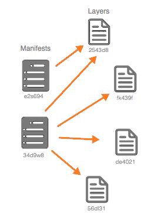
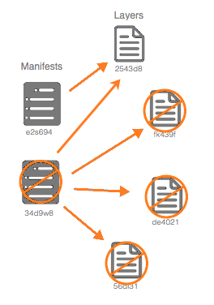

近期调研了Registry存储空间管理相关的内容，特与大家分享相关收获。调研时Registry最新版本为registry:2.5.0-rc.1

## 相关资料

这里是index: https://github.com/docker/distribution

这里是roadmap，包括registry未来会实现的特性：https://github.com/docker/distribution/blob/master/ROADMAP.md

这篇是API说明：https://github.com/docker/distribution/blob/master/docs/spec/api.md

这篇是gc功能的说明：https://github.com/docker/distribution/blob/e66f9c14409f1834fe40278635da55ca4063c4f6/docs/garbage-collection.md

这篇介绍了registry部署相关内容：https://github.com/docker/distribution/blob/master/docs/deploying.md

这篇介绍了registry的配置：https://github.com/docker/distribution/blob/master/docs/configuration.md

## registry简易安装

首先来介绍如何在本地安装一个简易的registry。我们用以下命令可以创建一个容器化的registry：

```
docker run -d -v `pwd`/registry/data/:/var/lib/registry --name registry -p 5000:5000 registry:2.5.0-rc.1
```

上述指令中，我们使用了官方的registry镜像，并将镜像中的/var/lib/registry挂载到主机中，该目录就是保存manifests和layers数据的目录。

通过下面两条指令可以向本地的registry服务push一个镜像：

```
  $ docker tag <local-image> localhost:5000/nginx

  $ docker push localhost:5000/nginx
```

push之后，我们可以在挂载目录中看到数据了：

```
  $ ls registry/data/docker/registry/v2/
  blobs  repositories
```

其中blobs子目录保存的layers数据，repositories子目录保存的是manifests数据。

现在我们可以通过API来访问registry服务了，但此时会发现delete相关的API是不能正常工作的（返回405错误），原来registry默认的配置是关闭delete相关操作的，需要修改默认配置来开启删除操作。

## delete操作

我们可以在容器中修改配置并重启，也可以通过volume方式来将配置文件挂载到宿主机，从而可以在宿主机中修改配置。

首先创建一个配置文件，在配置文件中开启delete开关：

```
  vi registry/config/config.yml

  version: 0.1
  log:
    fields:
      service: registry
  storage:
      delete:
          enabled: true #打开delete开关
      cache:
          blobdescriptor: inmemory
      filesystem:
          rootdirectory: /var/lib/registry
  http:
      addr: :5000
      headers:
          X-Content-Type-Options: [nosniff]
  health:
    storagedriver:
      enabled: true
      interval: 10s
      threshold: 3
```

将配置文件挂载到registry容器中。

```
  docker run -d -v `pwd`/registry/data/:/var/lib/registry -v `pwd`/registry/config/config.yml:/etc/docker/registry/config.yml --name registry -p 5000:5000 registry:2.5.0-rc.1
```

这样我们就可以通过API执行delete相关操作了。通过API说明可以发现删除manifest需要获取对应的digest，这些digest需要访问相应的get接口来获取。

通过下面的方式可以获取nginx:latest镜像的digest，响应的Docker-Content-Digest头就是该镜像的digest值。注意，该方法发送的是一个HEAD请求，请求设置的Accept头是必须的，否则获取不到正确的digest。

```
  $ curl -I -H "Accept: application/vnd.docker.distribution.manifest.v2+json" localhost:5000/v2/nginx/manifests/latest
  HTTP/1.1 200 OK
  Content-Length: 2187
  Content-Type: application/vnd.docker.distribution.manifest.v2+json
  Docker-Content-Digest: sha256:94d217c3f369593b85b402d423734a3b6eb63fe07534e3123ac6f60e83b3ce24
  Docker-Distribution-Api-Version: registry/2.0
  Etag: "sha256:94d217c3f369593b85b402d423734a3b6eb63fe07534e3123ac6f60e83b3ce24"
  X-Content-Type-Options: nosniff
  Date: Thu, 16 Jun 2016 08:25:25 GMT
```

有了digest就可以调用对应的API来删除manifest

```
  $ curl -i -X DELETE localhost:5000/v2/nginx/manifests/sha256:94d217c3f369593b85b402d423734a3b6eb63fe07534e3123ac6f60e83b3ce24
  HTTP/1.1 202 Accepted
  Docker-Distribution-Api-Version: registry/2.0
  X-Content-Type-Options: nosniff
  Date: Thu, 16 Jun 2016 04:53:56 GMT
  Content-Length: 0
  Content-Type: text/plain; charset=utf-8
```

虽然删除了manifest，通过API也读取不到对应镜像的信息了，但是blobs子目录下的空间并没有被释放。原来DELETE API只是删除了manifest对layer的引用，并未真正的删除对应的layer，删除layer是通过registry gc完成的。

## registry gc

在了解gc之前，我们先简单了解一下manifest和layer的关系。每当向registry push一个镜像，就会生成一个manifest，它描述了镜像的信息。从GET API中获取的内容就是从manifest文件中读取的，manifest会记录镜像引用的layer，两者的关系如下图所示：

  

为了节省空间，相同的layer只会在registry中保存一次，这样不同镜像就可能会引用相同的layer。因此不能随意删除registry中的layer，否则可能使得镜像无法下载。当删除manifest时，就会出现下图所示情况：

  

此时下方的三个layer将变为未引用的状态，未引用的layer对于registry来说就像垃圾一样，占用空间但却没有用处。registry gc功能就是用来清理这些未引用的layer。

上文提到DELETE API并未真正删除layer，其相当于是dereference操作，从而产生未引用的layer。

registry gc的工作原理参考[这里](https://github.com/docker/distribution/blob/e66f9c14409f1834fe40278635da55ca4063c4f6/docs/garbage-collection.md#how-garbage-collection-works)，它分成mark和sweep两个阶段。mark阶段会扫描所有manifest，列出所有引用的layer的集合。sweep阶段会扫描所有layer，不在mark集合中的layer会被删除。

我们可以通过容器中的registry指令来执行gc功能：

```
  $ registry garbage-collect /etc/docker/registry/config.yml 
  INFO[0000] Deleting blob: /docker/registry/v2/blobs/sha256/a9/a97a0c1976715d95ee07e1e086011e6321919ba85452d5c709c9201af2262cb7  go.version=go1.6.2 instance.id=a3385b4b-a122-4cca-ae23-39f2dce261e3
  INFO[0000] Deleting blob: /docker/registry/v2/blobs/sha256/d0/d0ca440e86378344053c79282fe959c9f288ef2ab031411295d87ef1250cfec3  go.version=go1.6.2 instance.id=a3385b4b-a122-4cca-ae23-39f2dce261e3
  INFO[0000] Deleting blob: /docker/registry/v2/blobs/sha256/0e/0eff792599d8378f8ce2059ad0e72c1516ca53cee451d50810cc154683bc0b0e  go.version=go1.6.2 instance.id=a3385b4b-a122-4cca-ae23-39f2dce261e3
  INFO[0000] Deleting blob: /docker/registry/v2/blobs/sha256/7c/7c99bfba27294e65ec1db8c05c872e029ddc99442c48f8cc58cdf04d33bfc19d  go.version=go1.6.2 instance.id=a3385b4b-a122-4cca-ae23-39f2dce261e3
  INFO[0000] Deleting blob: /docker/registry/v2/blobs/sha256/84/847e761c0c61dc5c0f3daa5f8e447bf473ef713ea49dc72c76818fe3bdbbaced  go.version=go1.6.2 instance.id=a3385b4b-a122-4cca-ae23-39f2dce261e3
  INFO[0000] Deleting blob: /docker/registry/v2/blobs/sha256/94/94d217c3f369593b85b402d423734a3b6eb63fe07534e3123ac6f60e83b3ce24  go.version=go1.6.2 instance.id=a3385b4b-a122-4cca-ae23-39f2dce261e3
  INFO[0000] Deleting blob: /docker/registry/v2/blobs/sha256/a3/a3ed95caeb02ffe68cdd9fd84406680ae93d633cb16422d00e8a7c22955b46d4  go.version=go1.6.2 instance.id=a3385b4b-a122-4cca-ae23-39f2dce261e3
```

增加--dry-run参数可以不执行删除操作，而查看两阶段的扫描结果：

```
  $ registry garbage-collect --dry-run /etc/docker/registry/config.yml                                                               
  nginx
  nginx: marking manifest sha256:d4dc76fa2b8c3a4de832e0fbd209c54400dfb4fe8b643c316a77ba98957ee271 
  nginx: marking blob sha256:6d6a6a7dae296854b09c2b3c16941416f1efe6dc89cbec1dade03f84233a783f
  nginx: marking blob sha256:960e66221a5aebfed7597e841ee2dfa3441b2460075041f26858320d3ba05835
  nginx: marking blob sha256:112f66ec2c6905325b4e7186792165a5ecb40dd25d8ceb7727ab150f88cc94c5
  nginx: marking blob sha256:386a96b627f3aec32aba0aa5290f37889394a76f8064202eb51dae892aaf2c1f
  nginx: marking blob sha256:b57f319efde35e1d14701b63c5c8fd888715ce32a7bbe13b91ac935e3c993347
  nginx: marking blob sha256:13b5f517f567ffc84a95a3973e51e4febf1b8f90ebcdbe31c5ee15ae55528d63
  nginx: marking blob sha256:a42387bfa94b3c4bef54584ba20c96b8208b3f10ce547bafa4a95b581daf7a22
  nginx: marking blob sha256:9b802f72d3249095f6d5dcf88d5083096d0fa00902eef6a196b1627777874a04
  nginx: marking blob sha256:4520c1976cedd427f135b3c7616a222e9f939a42904e44f8235bf25c326a1ab9
  nginx: marking blob sha256:89f4c89d72642f2db66a8402c0980aa626fb203c20ebad5570210fba9ffc79b0
  nginx: marking blob sha256:53629dd5771132023a7fa9c1c38c893ccb30065334e69c80b9b2c0df98f24fd3
  nginx: marking configuration sha256:0711f18a160cdd57068f9e8626b06fde23d93b065ea5834f9d0a753b3a1cfca5
  13 blobs marked, 7 blobs eligible for deletion
  blob eligible for deletion: sha256:a97a0c1976715d95ee07e1e086011e6321919ba85452d5c709c9201af2262cb7
  blob eligible for deletion: sha256:d0ca440e86378344053c79282fe959c9f288ef2ab031411295d87ef1250cfec3
  blob eligible for deletion: sha256:0eff792599d8378f8ce2059ad0e72c1516ca53cee451d50810cc154683bc0b0e
  blob eligible for deletion: sha256:7c99bfba27294e65ec1db8c05c872e029ddc99442c48f8cc58cdf04d33bfc19d
  blob eligible for deletion: sha256:847e761c0c61dc5c0f3daa5f8e447bf473ef713ea49dc72c76818fe3bdbbaced
  blob eligible for deletion: sha256:94d217c3f369593b85b402d423734a3b6eb63fe07534e3123ac6f60e83b3ce24
  blob eligible for deletion: sha256:a3ed95caeb02ffe68cdd9fd84406680ae93d633cb16422d00e8a7c22955b46d4
```

此时可以发现blobs子目录下的数据已被清理了

## 清理流程

目前registry还没有提供自动清理的功能，应该会在未来的版本中加入。在目前的版本中，清理流程应该是这样的：

1. push镜像之前通过API获取指定镜像已有manifest的digest
2. push镜像
3. 通过digest和API删除旧镜像的manifest
4. 指定定时任务定期调用registry garbage-collect。注：调用前需修改registry配置，使其变为read-only，再执行gc，之后恢复registry配置，参考[这里](https://github.com/docker/distribution/blob/master/docs/configuration.md#read-only-mode)。

## upload清理

查看repositories目录可以看到每个仓库都有一个_uploads目录，这个目录会保存镜像push时的数据。当我们在push过程中出现了中断而再次push的时候，可以发现push并不是重新开始的，这就是因为上次push的数据已在_uploads目录中，后续push操作可以从上次中断时开始。

registry对_uploads数据实现了自动清理的功能，我们可以在registry的配置中修改清理周期，参考[这里](https://github.com/docker/distribution/blob/master/docs/configuration.md#upload-purging)。

## 已知问题

目前registry的清理存在以下问题：

1. gc是非事务性操作。删除前最好置为read-only，而此时registry将暂时不能提供push服务。
2. 没有查询manifest digest列表的API。因此push前需要先查询对应镜像的digest，否则push之后无法获取旧镜像的digest。并且如果由于网络原因未能调用DELETE API时，此时需要额外的容错逻辑和持久化策略来保证后续可以删除过期的manifest。
3. 同样由于上述原因，对于已存在的过期的manifest无法进行清理操作。
4. gc时间待确认，使用blobs 5.2G + repositries 28M的数据测试需要花2-3秒的扫描和清理时间。